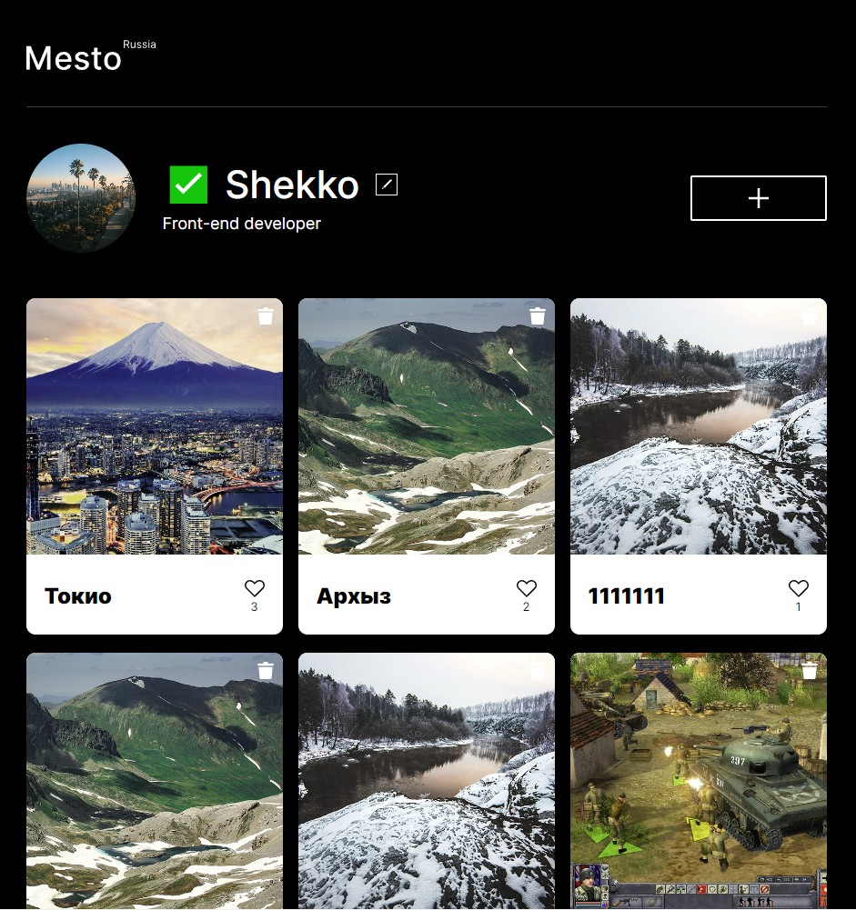
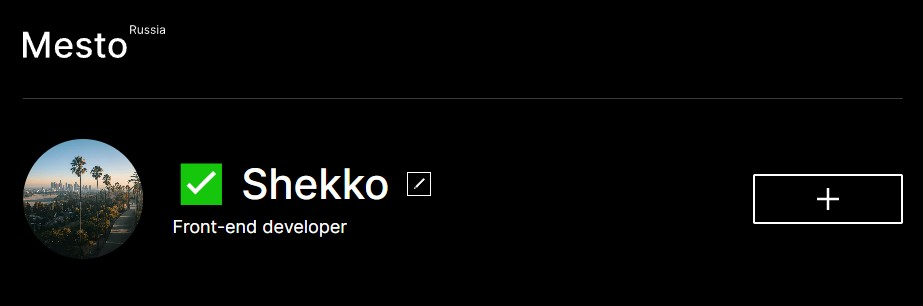
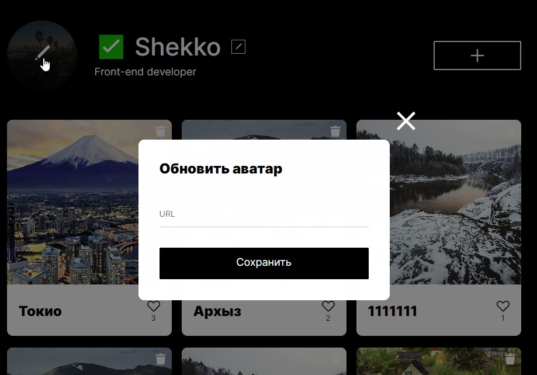
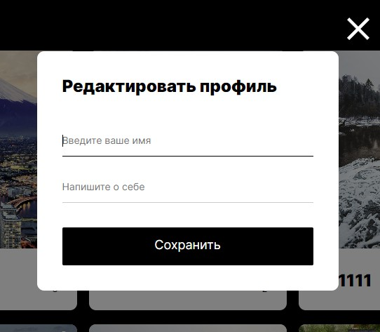
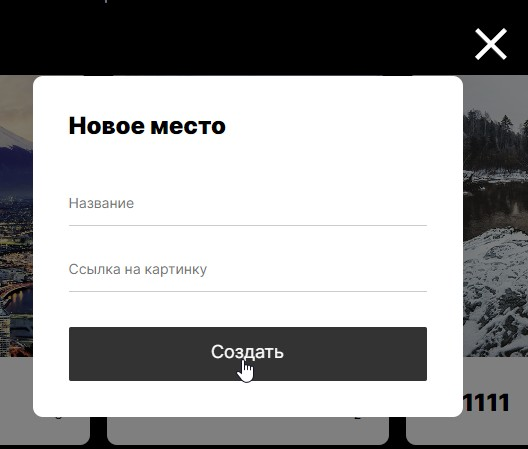

<h1 align="center">Проект <a style="color: #4285B4;" href="https://daniilshat.ru/" target="_blank">mesto-react</a> 


---

<div align="center" ></div>

<div align="center">

   

</div>

---

<h2 style="color: #4285B4;" >Скачать:</h2>

```
git clone https://github.com/Shekko777/mesto-react.git
```

<p>Включить локальный сервер в проекте:</p>

```
npm run start
```

---

<h2 style="color: #4285B4;">О проекте:</h2>

<p style="width: 600px; font-weight: 500">Адаптированное <span style="padding: 5px; background-color: #F5F5F5; font-weight: 700;">web-приложение</span> с настройкой личного профиля и общей базой данных карточек на сервере. Загрузка информации происходит через API с fetch запросами. Приложение разрабатывалось на React с использованием функциональных компонентов.</p>

<a href="https://github.com/Shekko777/mesto" style="font-weight: 700;">Mesto</a> в версии обычного сайта

---

<div style="display: flex; align-items: start; margin-bottom: 20px;"><h2 style="color: #4285B4; display: inline; margin-right: 20px;">Работа с кодом:</h2>  </div>

<p style="width: 600px; font-weight: 500">1. Для добавления различных форм используется функциональный компонент общей формы:</p>

```
  <PopupWithForm name={name} title={title} buttonText={buttonText} isOpen={isOpen} isClose={isClose}>
    {props.child} // Передача разных друг от друга инпутов.

    /*
      Пример:
      <input defaultValue="" type="URL" placeholder="URL" required />
    */
  </PopupWithForm>

```

<p style="width: 600px; font-weight: 500">2. Для передачи различных состояний используется стейт из коробки React:</p>

```
  const [active, setActive] = React.useState(false);
```

<p style="width: 600px; font-weight: 500">После чего можно применять его в функциях для изменения активных состояний</p>

```
  function onClickButton() {
    setActive(!active);
  }

  <Main onClick={onClickButton} />
```

<p style="width: 600px; font-weight: 500">3. Запрос данных сервера происходит через хук <span style="padding: 5px; background-color: #F5F5F5;">React.useEffect()</span> при старте страницы:</p>

```
  React.useEffect(() => {
    // your function

  }, [] /*Обязательный массив зависимостей, иначе будет утечка памяти. Можно оставить пустым, если зависимостей нет*/)
```

<p style="width: 600px; font-weight: 500">4. Для создания карточек используется функциональный компонент, в который передаётся key из card._id:</p>

```
  cards.map(card => {
    <Card key={card._id} onCardClick={onCardClick} card={card}/>
  })
```

---

<h2 style="color: #4285B4;"> Скринкаст приложения:</h2>

<div align="center">

  <h4>Настройка собственного профиля</h4>



<h4>Обновление аватара</h4>



<h4>Обновление профиля</h4>



<h4>Добавление нового места</h4>


</div>

<h3 style="opacity: 0.3;">© Created by Shekko.</h3>
